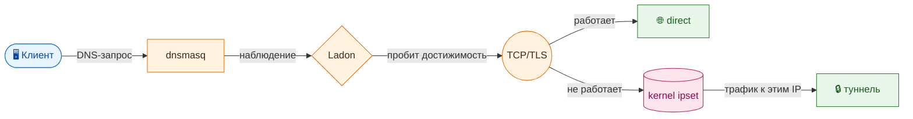
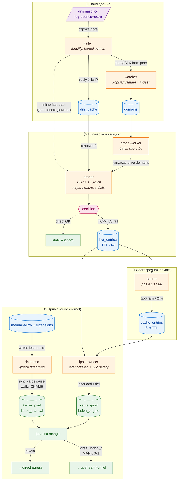

<div align="center">


# 🩸 Ladon

**Автоматический split-tunneling для VPN-шлюзов в сетях с DPI**

[](https://github.com/belotserkovtsev/ladon/actions/workflows/ci.yml)
[](https://github.com/belotserkovtsev/ladon/releases)
[](go.mod)
[](LICENSE)

</div>

Ladon наблюдает трафик клиентов шлюза, проверяет домены на достижимость и строит список из ip-адресов, подверженных DPI-блокировкам. **За доли секунды**

Задуман для WireGuard-шлюзов с `dnsmasq` и апстрим-туннелем наружу,
но легко адаптируется под любой стек с fwmark-routing и ipset.

---

## 🩸 Ключевые возможности

- **Auto-discovery** — probe-driven обнаружение DPI-заблокированных доменов из живого трафика, без ручных списков
- **Curated extensions** — готовые allow/deny-подборки (`ai`, `twitch`, `tiktok`, `ru-direct`, ...) подключаются одной строкой в YAML
- **Sub-second routing** — от первого DNS-запроса клиента до правила в kernel ipset в среднем 0.5с
- **Долговременная память** — нестабильные блоки исчезают сами через 24ч, стабильные оседают в постоянный cache (≥50 fails / 24ч)
- **Exit-compare валидатор** (опционально) — отдельный probe-сервер на residential ISP / 4G / офшоре отсеивает методологические False Positive

---

## 📦 Установка

Одной командой на Debian/Ubuntu (нужны root-права):

```bash
curl -fsSL https://github.com/belotserkovtsev/ladon/releases/latest/download/install.sh \
  | sudo bash
```

**Routing — твоя зона ответственности.** Ладон только наполняет ipset'ы. iptables / ip rule / fwmark routing зависят от твоей WG-топологии

---

## ⚡ Производительность

**От первого DNS-запроса до правила в kernel ipset — полсекунды в среднем.** В постоянный список попадает только то, что подтвердилось ≥50 раз за сутки — моргания провайдера не доезжают.

| Метрика | Значение |
|---|---|
| Реакция на новый блок | **0.3 – 1.1 с** (≈0.5 с) |
| Пропускная способность | **~65 доменов/с** на 2 CPU |
| Накладные расходы пайплайна | **~50 мс** сверх сети |
| RSS | **~20 МБ** |

Воспроизвести числа: `go test -run TestPipeline ./internal/engine/` — тест бьёт в [TEST-NET-1](https://datatracker.ietf.org/doc/html/rfc5737) (`192.0.2.1`), пакеты туда дропаются на апстрим-роутерах = реалистичный «тихий drop» без сети. Разброс 0.3-1.1 с: нижняя граница — мгновенный TCP RST от DPI, верхняя — silent drop с ожиданием полного 800 мс таймаута.

---

## 💡 Как это работает


<details>
<summary><b>🔌 Глубокая схема пайплайна</b></summary>



</details>

<details>
<summary>🔌 Состояния домена</summary>

Состояние хранится в `domains.state`; «живые» списки для роутинга — в `hot_entries` и `cache_entries`.

| Состояние | Что значит | Как попадает | Как уходит |
|---|---|---|---|
| `new` | Видели DNS-query, но ещё не пробовали коннектиться | Первая ingest-строка | После первого probe |
| `ignore` | Прямой путь работает, туннель не нужен | Probe прошёл TCP+TLS | Следующий probe может вернуть в цикл, если начнёт падать |
| `hot` | Probe обнаружил блок — домен временно в ipset | Probe упал на TCP или TLS | Запись в `hot_entries` снимается через 24 ч после последнего fail; при ≥50 подтверждениях scorer переводит в `cache` |
| `cache` | Стабильно заблокирован, в ipset навсегда | Scorer: ≥50 fails за 24 ч | Только вручную (cache-demotion на обратном пробе — в бэклоге) |

</details>

---

## 🛠 Конфигурация

Основной способ — YAML-файл, путь которого передаётся флагом `-config`. Без файла движок едет на дефолтах из [`internal/engine/engine.go`](internal/engine/engine.go).

Пример `/etc/ladon/config.yaml`:

```yaml
logfile: /var/log/dnsmasq.log
manual_allow: /etc/ladon/manual-allow.txt
manual_deny: /etc/ladon/manual-deny.txt

probe:
  mode: local         # local | exit-compare
  timeout: 800ms
  cooldown: 5m
  concurrency: 8

scorer:
  interval: 10m
  window: 24h
  fail_threshold: 50

ipset:
  name: ladon_engine        # probe-driven hot/cache
  manual_name: ladon_manual # populates dnsmasq'ом для manual-allow + extensions
  interval: 30s

hot_ttl: 24h
dns_freshness: 6h
```

### CLI-флаги

Дополнение к YAML — для простых случаев и для разовых override'ов:

```
ladon -db <path> [-config <path>] run [-from-start] [-manual-allow <path>] [-manual-deny <path>] <dnsmasq-log-path>
```

Пути (`-manual-allow`, `-manual-deny`) перебивают одноимённые поля YAML, если заданы оба. Тонкие knobs задаются только через файл.

### Extensions — преднастроенные allow/deny-списки

С релизом ладона шипаются тематические подборки доменов двух видов:

- **Allow** — для сервисов, которые **гео-блокируют российский регион со своей стороны** (probe их распознать не может — TLS handshake проходит, но сервис в ответ говорит «not available in your country»).
- **Deny** — для сервисов, которые НИКОГДА не должны идти через туннель: внутренние LAN, гео-fenced рос-сервисы (Госуслуги, банки) ломающиеся через иностранный exit, шумный мониторинг.

Подключаются опционально по имени:

```yaml
allow_extensions:
  - ai
  - twitch
  - tiktok
deny_extensions:
  - ru-direct
# extensions_path: /opt/ladon/extensions   # default
```

**Allow-семантика.** Домены **всегда** идут через туннель, минуя probe-пайплайн. Реализовано через делегирование dnsmasq: при старте ладон пишет `/etc/dnsmasq.d/ladon-manual.conf` со строками `ipset=/openai.com/ladon_manual`, `ipset=/twitch.tv/ladon_manual` и т.д., потом `systemctl reload dnsmasq`. Дальше **dnsmasq сам** при резолве каждого домена walks CNAME-цепочку и кладёт все финальные A-записи в kernel ipset `ladon_manual` — **до того как ответ DNS уйдёт клиенту**. Первый-же TCP SYN клиента уже находит свой destination в kernel set'е → tunnel.

Достаточно указать корневой домен — dnsmasq матчит по суффиксу. `openai.com` покрывает `cdn.openai.com` (Azure-CDN), `chat.openai.com` (CloudFlare), `developers.openai.com` (Vercel) и любые другие поддомены без необходимости их перечислять. CNAME-цепочки уходят в правильный ipset нативно, без нашей ladon-side логики.

**Deny-семантика.** Домены грузятся в `manual_entries` с `list_name='deny'`. Tailer пропускает их (skip-at-ingest, не попадают в `domains`), probe-worker фильтрует через `ListProbeCandidates`, `ladon prune` вычищает уже накопленные denied rows. Фильтр срабатывает по точному совпадению или eTLD+1: `mail.ru` в списке закроет `privacy-cs.mail.ru` автоматически.

Доступные пресеты:

| Имя | Тип | Покрытие |
|---|---|---|
| `ai` | allow | OpenAI / ChatGPT, Anthropic / Claude |
| `twitch` | allow | twitch.tv + CDN |
| `tiktok` | allow | TikTok / ByteDance overseas (core, regional CDN, backbone, SDK) |
| `ru-direct` | deny | gosuslugi.ru, mail.ru, vk.com, vk-analytics.ru — RU-сервисы, которым оффшорный VPN не нужен |

Полный список — в `/opt/ladon/extensions/<name>.txt`. Свои подборки можно положить в тот же каталог (или в `extensions_path` куда угодно) и подключить в config так же по имени. Подробности в [release/extensions/README.md](release/extensions/README.md).

Обычные `/etc/ladon/manual-allow.txt` и `/etc/ladon/manual-deny.txt` продолжают работать параллельно — extensions просто удобнее для тематических подборок, которые хочется включать/выключать одной строкой.

> **Миграция с v0.4.x:** ключ `extensions:` переименован в `allow_extensions:` для симметрии с `deny_extensions:`. Старый ключ ещё принимается (с warning'ом в журнал), будет удалён в v0.6.

### Очистка состояния — `ladon prune`

Иногда нужно сбросить накопленные данные руками — например, после смены логики probe (включили exit-compare, и cache мог содержать FP, которые новая логика отсеяла бы), или просто отрезать старую историю проб для размера БД.

```sh
# Что бы удалилось (без выполнения)
ladon -db /opt/ladon/state/engine.db prune -cache -dry-run

# Удалить весь cache
ladon -db /opt/ladon/state/engine.db prune -cache

# Удалить probe-ряды старше конкретной даты (RFC3339)
ladon -db /opt/ladon/state/engine.db prune -probes -before 2026-04-16T11:14:00Z

# Полная очистка трёх таблиц до какой-то отметки
ladon -db /opt/ladon/state/engine.db prune -cache -hot -probes -before 2026-04-16T11:14:00Z
```

Флаги:

| флаг | действие |
|---|---|
| `-cache` | удаляет `cache_entries` |
| `-hot` | удаляет `hot_entries` |
| `-probes` | удаляет `probes` |
| `-before <RFC3339>` | фильтр по дате; без флага удаляет всё |
| `-dry-run` | показать счётчики без выполнения |

После `prune` движок автоматически сбрасывает `state` в `new` для доменов, у которых не осталось ни hot, ни cache записи — на следующем DNS-запросе домен пройдёт пайплайн заново.

**Почему нет авто-prune при upgrade:** cache-записи зарабатываются дорого (≥50 fails / 24ч), и тихая чистка при каждом релизе создавала бы UX-провалы. Делать prune — осознанное решение оператора.

### Exit-compare через внешний пробинг-сервер

Локальная проба видит мир глазами шлюза. Это хорошо ловит DPI-блоки, которые цепляются ровно к тому пути, по которому идёт клиент. Но даёт ложные срабатывания, когда сам домен не отвечает на :443 — `imap.gmail.com` живёт на :993, `bgp.he.net` на 8080, и т.д. Локальный probe в таких случаях видит «TCP fail» и тащит домен в hot, хотя блока нет.

`mode: exit-compare` решает это, добавляя вторую точку зрения: HTTP-сервер на твоей стороне, который пробит тот же домен из другого vantage point (residential ISP, 4G-модем, офшорная VPS, что угодно).

```yaml
probe:
  mode: exit-compare
  remote:
    url: https://my-probe-server.example.com/probe
    timeout: 2s
    auth_header: Authorization
    auth_value: Bearer mysecrettoken
```

Логика вердикта на batch-перепробе:

| local | remote | вердикт |
|---|---|---|
| OK | (не запускается) | Ignore — direct работает |
| FAIL | OK | **Hot** — настоящий DPI-блок, снаружи домен живой |
| FAIL | FAIL | **Ignore** — methodological FP (порт не тот / мёртвый сервер / domain не отвечает ниоткуда) |
| FAIL | unavailable | **Hot** — твой proб-сервер недоступен (timeout / non-200 / network) → не overrule'им, остаёмся с локальным вердиктом. Reason помечен `remote:unavailable:...` |

Последняя строка важна: outage твоего proб-сервера **не должен** тихо снимать ipset с реально-заблокированных доменов. Поэтому транспортная ошибка интерпретируется как «нет мнения», а не как «remote сказал FAIL».

Inline fast-path всегда использует только локальную пробу — гонять remote round-trip на каждом первом запросе клиента сломало бы 0.5-секундный бюджет. Если inline ошибся — batch-перепроба с exit-compare его поправит и удалит запись из ipset.

HTTP-контракт описан в [`docs/probe-api.md`](docs/probe-api.md), референсная имплементация на Go — в [`examples/probe-server/`](examples/probe-server/).

---

## 🔍 Наблюдаемость

Всё состояние живёт в SQLite. Полезные запросы:

```bash
DB=/opt/ladon/state/engine.db

# Распределение по состояниям
sqlite3 "$DB" "SELECT state, COUNT(*) FROM domains GROUP BY state"

# Топ-15 «горячих» доменов по количеству визитов
sqlite3 -column "$DB" \
  "SELECT domain, hit_count, state FROM domains
   WHERE state IN ('hot','cache')
   ORDER BY hit_count DESC LIMIT 15"

# Сколько IP сейчас в kernel ipset'ах
sudo ipset list ladon_engine -t | grep entries
sudo ipset list ladon_manual -t | grep entries

# Причины попадания в hot
sqlite3 -column "$DB" \
  "SELECT d.domain, p.failure_reason, p.latency_ms
   FROM domains d JOIN probes p ON p.id = d.last_probe_id
   WHERE d.state = 'hot' ORDER BY p.created_at DESC LIMIT 20"

# Промоушны в cache за последний час
sqlite3 -column "$DB" \
  "SELECT domain, promoted_at, reason FROM cache_entries
   WHERE promoted_at > datetime('now','-1 hour')"
```

Live-логи: `journalctl -u ladon -f`.

---

## 🏗 Разработка

```sh
# Unit + race-тесты (быстро, без сети)
go test -race -short ./...

# End-to-end пайплайн-перфтесты (живые TCP-timeout на RFC 5737 192.0.2.1)
go test -v -run TestPipeline ./internal/engine/

# Кросс-компиляция под Linux
GOOS=linux GOARCH=amd64 go build -o dist/ladon ./cmd/ladon
```

### Структура пакетов

| Путь | Ответственность |
|---|---|
| `cmd/ladon/` | CLI: `init-db`, `run`, `probe`, `observe`, `list`, `hot`, `tail` |
| `internal/tail/` | fsnotify-based follower для файла лога |
| `internal/dnsmasq/` | Парсер log-строк (query / reply / cached / forwarded) |
| `internal/watcher/` | Нормализация и ingest DNS-событий |
| `internal/storage/` | SQLite access layer + embedded schema |
| `internal/etld/` | Обёртка над `golang.org/x/net/publicsuffix` |
| `internal/prober/` | Probe: `LocalProber` (TCP + TLS-SNI) и `RemoteProber` (HTTP к внешнему сервису) за общим `Prober`-интерфейсом |
| `internal/config/` | Загрузка и валидация YAML-конфига |
| `internal/decision/` | Классификация probe → {Ignore, Hot} |
| `internal/dnsmasqcfg/` | Генерация `/etc/dnsmasq.d/ladon-manual.conf` для manual-allow + extensions |
| `internal/scorer/` | Промоушн hot → cache по количеству fails в окне |
| `internal/manual/` | Загрузчик allow/deny-списков из файлов |
| `internal/ipset/` | Обёртка над CLI `ipset` (Add / Del / Reconcile / Save) |
| `internal/publisher/` | Atomic-write текстового файла с hot-доменами |
| `internal/engine/` | Оркестровка: 6 горутин, каналы, lifecycle |

### CI

[GitHub Actions workflow](.github/workflows/ci.yml) прогоняет на каждый push
в `main` и на каждый PR:

- `go build ./...`
- `go vet ./...`
- `go test -race -short ./...` — unit-тесты с race-детектором.
- `go test -run TestPipeline ./internal/engine/` — end-to-end перфтесты.

---

## 📜 Лицензия

[MIT](LICENSE). Делайте что хотите — форкайте, встраивайте, коммерческое
использование, всё разрешено. Требуется только сохранить упоминание автора
в копиях.
