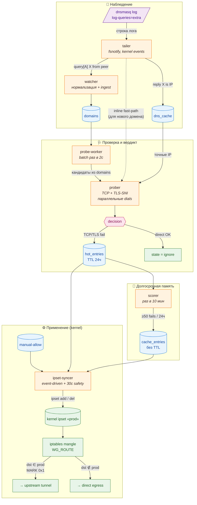

<div align="center">


# 🩸 Ladon

**Автоматический split-tunneling для VPN-шлюзов в сетях с DPI**

[](https://github.com/belotserkovtsev/ladon/actions/workflows/ci.yml)
[](https://github.com/belotserkovtsev/ladon/releases)
[](go.mod)
[](LICENSE)

</div>

Ladon наблюдает трафик клиентов шлюза, проверяет домены на достижимость и строит список из ip-адресов, которые нужно пустить через VPN. **За доли секунды**. Ничего не нужно размечать руками — движок учится сам на поведении пира и реакции сети.

Задуман для WireGuard-шлюзов с `dnsmasq` и апстрим-туннелем наружу,
но легко адаптируется под любой стек с fwmark-routing и ipset.

---

## ⚡ Производительность

**От первого DNS-запроса до правила в kernel ipset — полсекунды в среднем.** В постоянный список попадает только то, что подтвердилось ≥50 раз за сутки — моргания провайдера не доезжают.

| Метрика | Значение |
|---|---|
| Реакция на новый блок | **0.3 – 1.1 с** (≈0.5 с) |
| Пропускная способность | **~65 доменов/с** на 2 CPU |
| Накладные расходы пайплайна | **~50 мс** сверх сети |
| RSS | **~20 МБ** |

### Почему быстро и точно

- **Нет split-brain с клиентом** — probe бьёт по IP из `dns_cache`, тем же, что dnsmasq отдал клиенту.
- **Параллельные TCP-dials** — худший случай `max(timeout)` вместо `sum(timeout)`.
- **Event-driven ipset** — probe сигналит syncer сразу после вердикта, без ожидания тикера.
- **eTLD+1 агрегация** — ≥2 подтверждённых поддомена тянут в ipset всю семью (CDN с UUID-поддоменами не утекают через direct).

<details>
<summary>Как воспроизвести числа локально</summary>

```sh
go test -run TestPipeline ./internal/engine/
```

Тест бьёт в [TEST-NET-1](https://datatracker.ietf.org/doc/html/rfc5737) (`192.0.2.1`) — зарезервированный IP, пакеты в который отбрасываются на апстрим-роутерах; получается реалистичный «тихий drop» без опоры на внешнюю сеть.

**Разброс 0.3 – 1.1 с:**
- Нижняя граница — DPI присылает мгновенный TCP RST. Probe падает сразу, цикл замыкается почти только за счёт чтения лога и записи в БД.
- Верхняя граница — DPI молчит (drop без ответа). Probe ждёт полный таймаут 800 мс, общая задержка = таймаут + накладные.

</details>

---

## 💡 Как это работает

Привычные режимы на обычном VPN упираются в один и тот же выбор без правильного ответа. **«Всё через туннель»** ломает гео-привязки российских сервисов — банки и Госуслуги отказываются пускать с иностранного IP, — и нагружает exit-канал трафиком, который по блокам не прогонялся бы. **«Всё напрямую»** не решает задачу, ради которой VPN и поднимали.

Ladon держит середину автоматически: пир ходит напрямую по умолчанию, а движок в фоне наблюдает его трафик и сам переключает через туннель только то, что реально заблокировано. На первый запрос клиент тратит от долей секунды до полутора — этого хватает, чтобы следующий пакет уже шёл правильным маршрутом.

### Путь одного домена

Предположим, клиент первый раз открывает `instagram.com`.

1. **Наблюдение.** Запрос прилетает в dnsmasq; тот пишет в лог пары строк — `query[A] instagram.com from 10.10.0.2` и `reply instagram.com is 157.240.20.174`. Tailer ловит обе через kernel-события fsnotify: первая уходит в таблицу `domains` (состояние `new`), IP-ы из второй складываются в `dns_cache`. Это ровно те адреса, которые увидел клиент — важно, чтобы движок бил именно по ним, а не по собственному resolve: на geo-routed CDN движок и клиент иначе видят разные IP.

2. **Проверка.** Как только watcher записал новый домен, в ту же миллисекунду запускается inline-проба: параллельные TCP-коннекты на `:443` по IP из `dns_cache` (берёт первый успешный), затем TLS-handshake с SNI. Сертификат не верифицируется — движку нужна только достижимость, а не доверие. Для старых доменов, у которых истёк 5-минутный cooldown, отдельный batch-воркер раз в 2 секунды делает то же самое по батчу кандидатов.

3. **Вердикт.** Если TCP или TLS упали — домен переходит в `hot` на 24 часа, и параллельно через буферный канал будится ipset-syncer: IP из `dns_cache` атомарно добавляются в kernel ipset `prod`. iptables mangle-правило `--match-set prod dst -j MARK 0x1` ловит следующий пакет клиента и разворачивает его в туннель. От первой DNS-записи до правила в ядре — в среднем полсекунды. Если прямой путь сработал — домен в `ignore`, никаких действий.

4. **Память.** Раз в 10 минут scorer проходится по `hot_entries`. Если домен за последние 24 часа упал ≥50 раз — он переезжает в `cache_entries` без TTL. Это разделение важно: короткие сетевые штормы (провайдер моргнул на 30 секунд) живут только в hot и сами исчезают через сутки, а стабильно заблокированные ресурсы оседают в постоянной памяти и перестают зря пробиваться.

5. **Маршрутизация.** ipset-syncer держит kernel ipset синхронным с union'ом `hot ∪ cache ∪ manual-allow`. Работает event-driven: каждое новое Hot-событие будит его немедленно, а safety-тикер раз в 30 секунд ловит всё, что могло потеряться. Дополнительно для доменов с ≥2 подтверждёнными сиблингами по eTLD+1 в ipset подтягиваются IP-ы всего корня — Meta раздаёт новые UUID-поддомены ежеминутно, и один упавший сразу уводит в туннель остальных.

<details>
<summary><b>🔌 Схема пайплайна (клик, чтобы развернуть)</b></summary>



</details>

### Состояния домена — справочник

Состояние домена хранится в колонке `domains.state`; «живые» списки для роутинга — в `hot_entries` и `cache_entries`. Переходы следуют из путя выше, вот таблица на случай если надо быстро свериться:

| Состояние | Что значит | Как попадает | Как уходит |
|---|---|---|---|
| `new` | Видели DNS-query, но ещё не пробовали коннектиться | Первая ingest-строка | После первого probe |
| `ignore` | Прямой путь работает, туннель не нужен | Probe прошёл TCP+TLS | Следующий probe может вернуть в цикл, если начнёт падать |
| `hot` | Probe обнаружил блок — домен временно в ipset | Probe упал на TCP или TLS | Запись в `hot_entries` снимается через 24 ч после последнего fail; при ≥50 подтверждениях за окно scorer переводит в `cache` |
| `cache` | Стабильно заблокирован, в ipset навсегда | Scorer: ≥50 fails за 24 ч | Только вручную оператором (cache-demotion на обратном пробе — в бэклоге) |

### Manual override-ы

Автоматика закрывает ~95% случаев, но остаются две ниши, где оператор хочет явно задать поведение:

- **`manual-allow.txt`** — домен попадает в ipset без probe. Полезно, когда блок проявляется на слое, который наш probe не видит (HTTP content filtering, SNI-спуфинг), или когда нужно принудительно загнать домен в туннель по приватным соображениям.
- **`manual-deny.txt`** — домен никогда не пробуется и не туннелируется. Для внутренних LAN-сервисов, гео-fenced российских сервисов (Госуслуги, банки), которые ломаются через иностранный exit, и для шумного мониторинга, который не хочется засорять probe-логами.

Файлы перечитываются при запуске сервиса; правка требует `systemctl restart ladon`.

---

## 📦 Установка

### Требования

- Linux (Debian 11+ / Ubuntu 22.04+ или аналогичный).
- `iptables` (legacy или nft-режим).
- `ipset`, `iptables-persistent` (`apt install ipset iptables-persistent`).
- `dnsmasq` с `log-queries=extra` и `log-facility` в файл.
- Рут-права (нужен доступ к `ipset` и к логу dnsmasq).
- Работающий шлюз с fwmark-routing и upstream-туннелем (WireGuard, Hysteria,
  любой кастомный cascade).

### Quickstart

```bash
# 1. Скачать последний релиз (или зафиксировать версию: TAG=v0.2.0)
TAG=$(curl -sSL "https://api.github.com/repos/belotserkovtsev/ladon/releases/latest" \
  | grep '"tag_name":' | head -1 | cut -d'"' -f4)
curl -L "https://github.com/belotserkovtsev/ladon/releases/download/${TAG}/ladon-linux-amd64.tar.gz" \
  | sudo tar -xz -C /opt

sudo mv /opt/ladon-linux-amd64-${TAG} /opt/ladon
sudo mkdir -p /opt/ladon/state /etc/ladon

# 2. Примеры manual-списков
sudo cp /opt/ladon/manual-allow.txt.example /etc/ladon/manual-allow.txt
sudo cp /opt/ladon/manual-deny.txt.example  /etc/ladon/manual-deny.txt

# 3. Создать ipset и правило в iptables mangle
sudo ipset create prod hash:ip family inet maxelem 65536
sudo iptables -t mangle -A WG_ROUTE -m set --match-set prod dst \
  -j MARK --set-mark 0x1
sudo ipset save > /etc/iptables/ipsets   # чтобы переживало reboot

# 4. Инициализировать БД и поставить сервис
sudo /opt/ladon/ladon \
  -db /opt/ladon/state/engine.db init-db
sudo install -m 0644 /opt/ladon/ladon.service \
  /etc/systemd/system/
sudo systemctl daemon-reload
sudo systemctl enable --now ladon

# 5. Проверить
systemctl status ladon
journalctl -u ladon -f
```

Подробнее — см. [release/INSTALL.md](release/INSTALL.md).

---

## 🛠 Конфигурация

Основной способ — YAML-файл, путь которого передаётся флагом `-config`. Без файла движок едет на дефолтах из [`internal/engine/engine.go`](internal/engine/engine.go).

Пример `/etc/ladon/config.yaml`:

```yaml
logfile: /var/log/dnsmasq.log
manual_allow: /etc/ladon/manual-allow.txt
manual_deny: /etc/ladon/manual-deny.txt

probe:
  mode: local         # local | exit-compare
  timeout: 800ms
  cooldown: 5m
  concurrency: 8

scorer:
  interval: 10m
  window: 24h
  fail_threshold: 50

ipset:
  name: prod
  interval: 30s

hot_ttl: 24h
dns_freshness: 6h
```

Все поля опциональны — пропущенные берутся из дефолтов:

| Параметр | Значение | Смысл |
|---|---|---|
| `probe.timeout` | 800 мс | Максимум на TCP/TLS dial |
| `probe.cooldown` | 5 мин | Минимальный интервал между probe одного домена |
| `probe.concurrency` | 8 | Семафор для inline probe из tailer |
| `hot_ttl` | 24 ч | Срок жизни записи в `hot_entries` |
| `ipset.interval` | 30 с | Safety-реконсил ipset (помимо event-driven) |
| `dns_freshness` | 6 ч | Возраст, после которого IP из dns_cache устаревает |
| `scorer.window` | 24 ч | Окно для подсчёта fails |
| `scorer.fail_threshold` | 50 | Порог fails для промоушна hot → cache |
| `scorer.interval` | 10 мин | Как часто scorer проходится |

### CLI-флаги

Дополнение к YAML — для простых случаев и для разовых override'ов:

```
ladon -db <path> [-config <path>] run [-from-start] [-manual-allow <path>] [-manual-deny <path>] <dnsmasq-log-path>
```

Пути (`-manual-allow`, `-manual-deny`) перебивают одноимённые поля YAML, если заданы оба. Тонкие knobs задаются только через файл.

### Exit-compare через внешний пробинг-сервер

Локальная проба видит мир глазами шлюза. Это хорошо ловит DPI-блоки, которые цепляются ровно к тому пути, по которому идёт клиент. Но даёт ложные срабатывания, когда сам домен не отвечает на :443 — `imap.gmail.com` живёт на :993, `bgp.he.net` на 8080, и т.д. Локальный probe в таких случаях видит «TCP fail» и тащит домен в hot, хотя блока нет.

`mode: exit-compare` решает это, добавляя вторую точку зрения: HTTP-сервер на твоей стороне, который пробит тот же домен из другого vantage point (residential ISP, 4G-модем, офшорная VPS, что угодно).

```yaml
probe:
  mode: exit-compare
  remote:
    url: https://my-probe-server.example.com/probe
    timeout: 2s
    auth_header: Authorization
    auth_value: Bearer mysecrettoken
```

Логика вердикта на batch-перепробе:

| local | remote | вердикт |
|---|---|---|
| OK | (не запускается) | Ignore — direct работает |
| FAIL | OK | **Hot** — настоящий DPI-блок, snaружи домен живой |
| FAIL | FAIL | **Ignore** — methodological FP (порт не тот / мёртвый сервер / domain не отвечает ниоткуда) |

Inline fast-path всегда использует только локальную пробу — гонять remote round-trip на каждом первом запросе клиента сломало бы 0.5-секундный бюджет. Если inline ошибся — batch-перепроба с exit-compare его поправит и удалит запись из ipset.

HTTP-контракт описан в [`docs/probe-api.md`](docs/probe-api.md), референсная имплементация на Go — в [`examples/probe-server/`](examples/probe-server/).

---

## 🔍 Наблюдаемость

Всё состояние живёт в SQLite. Полезные запросы:

```bash
DB=/opt/ladon/state/engine.db

# Распределение по состояниям
sqlite3 "$DB" "SELECT state, COUNT(*) FROM domains GROUP BY state"

# Топ-15 «горячих» доменов по количеству визитов
sqlite3 -column "$DB" \
  "SELECT domain, hit_count, state FROM domains
   WHERE state IN ('hot','cache')
   ORDER BY hit_count DESC LIMIT 15"

# Сколько IP сейчас в kernel ipset
sudo ipset list prod -t | grep entries

# Причины попадания в hot
sqlite3 -column "$DB" \
  "SELECT d.domain, p.failure_reason, p.latency_ms
   FROM domains d JOIN probes p ON p.id = d.last_probe_id
   WHERE d.state = 'hot' ORDER BY p.created_at DESC LIMIT 20"

# Промоушны в cache за последний час
sqlite3 -column "$DB" \
  "SELECT domain, promoted_at, reason FROM cache_entries
   WHERE promoted_at > datetime('now','-1 hour')"
```

Live-логи: `journalctl -u ladon -f`.

---

## 🏗 Разработка

```sh
# Unit + race-тесты (быстро, без сети)
go test -race -short ./...

# End-to-end пайплайн-перфтесты (живые TCP-timeout на RFC 5737 192.0.2.1)
go test -v -run TestPipeline ./internal/engine/

# Кросс-компиляция под Linux
GOOS=linux GOARCH=amd64 go build -o dist/ladon ./cmd/ladon
```

### Структура пакетов

| Путь | Ответственность |
|---|---|
| `cmd/ladon/` | CLI: `init-db`, `run`, `probe`, `observe`, `list`, `hot`, `tail` |
| `internal/tail/` | fsnotify-based follower для файла лога |
| `internal/dnsmasq/` | Парсер log-строк (query / reply / cached / forwarded) |
| `internal/watcher/` | Нормализация и ingest DNS-событий |
| `internal/storage/` | SQLite access layer + embedded schema |
| `internal/etld/` | Обёртка над `golang.org/x/net/publicsuffix` |
| `internal/prober/` | Probe: `LocalProber` (TCP + TLS-SNI) и `RemoteProber` (HTTP к внешнему сервису) за общим `Prober`-интерфейсом |
| `internal/config/` | Загрузка и валидация YAML-конфига |
| `internal/decision/` | Классификация probe → {Ignore, Watch, Hot} |
| `internal/scorer/` | Промоушн hot → cache по количеству fails в окне |
| `internal/manual/` | Загрузчик allow/deny-списков из файлов |
| `internal/ipset/` | Обёртка над CLI `ipset` (Add / Del / Reconcile / Save) |
| `internal/publisher/` | Atomic-write текстового файла с hot-доменами |
| `internal/engine/` | Оркестровка: 6 горутин, каналы, lifecycle |

### CI

[GitHub Actions workflow](.github/workflows/ci.yml) прогоняет на каждый push
в `main` и на каждый PR:

- `go build ./...`
- `go vet ./...`
- `go test -race -short ./...` — unit-тесты с race-детектором.
- `go test -run TestPipeline ./internal/engine/` — end-to-end перфтесты.

---

## 📜 Лицензия

[MIT](LICENSE). Делайте что хотите — форкайте, встраивайте, коммерческое
использование, всё разрешено. Требуется только сохранить упоминание автора
в копиях.
