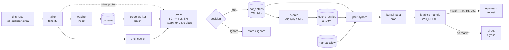

# 🩸 Ladon

[](https://github.com/belotserkovtsev/ladon/actions/workflows/ci.yml)
[](https://github.com/belotserkovtsev/ladon/releases)
[](go.mod)

**Автоматический split-tunneling для VPN-шлюзов в сетях с DPI**

Ladon наблюдает трафик клиентов шлюза, проверяет домены на достижимость
напрямую и строит список того, что нужно пустить через VPN, а остальное
оставить идти прямо через провайдера. Ничего не нужно размечать руками —
движок учится сам на поведении пира и реакции сети.

Задуман для WireGuard-шлюзов с `dnsmasq` и апстрим-туннелем наружу,
но легко адаптируется под любой стек с fwmark-routing и ipset.

---

## Зачем

Привычные режимы на обычном VPN:

- **«Всё через туннель»** — латенси растёт даже для российских сервисов,
  exit-канал становится бутылочным горлом, банки и госуслуги ломаются
  из-за гео-блока.
- **«Всё напрямую»** — заблокированные сайты не открываются.

Ladon держит золотую середину автоматически. Пир клиента ходит напрямую
по умолчанию; как только движок видит, что у некоторого домена прямой
путь не работает, он пропускает его через туннель. Всё это происходит в течение одной
секунды от момента первого запроса.

---

## Как это работает, коротко

1. **Наблюдение.** Tailer читает лог dnsmasq через kernel-события fsnotify
   и получает оба сигнала: кто какой домен запросил и какие IP ему
   отдал upstream. DNS-ответы складываются в `dns_cache` — это тот же
   набор адресов, что видит клиент.
2. **Проверка.** Prober берёт IP из `dns_cache` и выполняет стадийный probe:
   TCP на порт 443 параллельно на несколько IP, затем TLS-handshake с SNI.
   Мы не доверяем цепочке сертификатов, нам нужна только реальная
   достижимость порта.
3. **Вердикт.** Если TCP или TLS падают — домен попадает в `hot_entries`
   (24 часа). Если прямой путь работает — `ignore`.
4. **Память.** Scorer агрегирует повторные неудачи: ≥50 fails за 24 часа
   и домен переходит в `cache_entries` навсегда. Кратковременные сбои
   живут только в hot и не засоряют постоянное состояние.
5. **Маршрутизация.** ipset-syncer собирает union из hot + cache + manual
   allow и атомарно сверяет с kernel ipset `prod`. eTLD+1-агрегация
   подтягивает сиблингов CDN (например, Meta генерирует новые UUID-поддомены
   — один зафейлился, остальные уходят в туннель автоматически). Каждый
   новый Hot триггерит reconcile немедленно через буферный канал, так что
   задержка «решение → правило в ядре» исчисляется десятками миллисекунд.

---

## ⚡ Производительность

| Метрика | Значение |
|---|---|
| **Query → IP в kernel ipset** | **0.3 – 1.1 с** (типично 0.5 с) |
| **Overhead пайплайна** | ~50 мс поверх probe-timeout |
| **Throughput** | ~65 доменов/с на 2 CPU |
| **Память** | ~20 МБ RSS на 500+ наблюдаемых доменов |

Латенси на нижней границе соответствует ситуации, когда DPI режет
соединение мгновенным RST; верхняя — когда fallback-путь выдерживает
полный probe-timeout в 800 мс. Клиент обычно делает автоматический
ретрай в 1–3 с, и ретрай уже попадает в туннель.

Все цифры замеряются в репозитории:
`go test -run TestPipeline ./internal/engine/`.

---

## 🔌 Архитектура



### Потоки решений

- **Fast-path** (inline probe): dnsmasq пишет `query[A] X.com from peer` →
  tailer ловит fsnotify-событие → watcher записывает наблюдение → отдельная
  горутина запускает probe немедленно, не дожидаясь тикера воркера.
- **Batch-path** (probe-worker): каждые 2 секунды забирает до 4 кандидатов,
  у которых истёк cooldown. Нужен для перепроверки hot-доменов и когда
  inline-семафор переполнен на пике DNS-флуда.
- **Scorer** проходится раз в 10 минут и промоутит стабильно блокированные
  домены из hot в cache.
- **ipset-syncer** реагирует на сигнал канала при каждом Hot-событии;
  safety-тикер раз в 30 секунд подхватывает что-то, если сигнал потерялся.

---

## 🧭 Состояния домена

```
 new  ──probe──▶  hot  ──≥50 fails / 24 ч──▶  cache  (постоянный)
  │                │
  │                └──expire 24 ч──▶ out of ipset (если не в cache)
  │
  └──probe direct OK──▶  ignore
```

`manual-allow` и `manual-deny` — ручные override-ы оператора:

- `manual-allow` — домен всегда в ipset, probe не выполняется.
- `manual-deny` — домен никогда не пробуется и не туннелируется
  (полезно для внутренних / LAN-сервисов и гео-fenced РФ-сервисов,
  которые ломаются через VPN).

---

## 📦 Установка

### Требования

- Linux (Debian 11+ / Ubuntu 22.04+ или аналогичный).
- `iptables` (legacy или nft-режим).
- `ipset`, `iptables-persistent` (`apt install ipset iptables-persistent`).
- `dnsmasq` с `log-queries=extra` и `log-facility` в файл.
- Рут-права (нужен доступ к `ipset` и к логу dnsmasq).
- Работающий шлюз с fwmark-routing и upstream-туннелем (WireGuard, Hysteria,
  любой кастомный cascade).

### Quickstart

```bash
# 1. Скачать релиз
TAG=v0.1.0
curl -L "https://github.com/belotserkovtsev/ladon/releases/download/${TAG}/ladon-linux-amd64.tar.gz" \
  | sudo tar -xz -C /opt

sudo mv /opt/ladon-linux-amd64-${TAG} /opt/ladon
sudo mkdir -p /opt/ladon/state /etc/ladon

# 2. Примеры manual-списков
sudo cp /opt/ladon/manual-allow.txt.example /etc/ladon/manual-allow.txt
sudo cp /opt/ladon/manual-deny.txt.example  /etc/ladon/manual-deny.txt

# 3. Создать ipset и правило в iptables mangle
sudo ipset create prod hash:ip family inet maxelem 65536
sudo iptables -t mangle -A WG_ROUTE -m set --match-set prod dst \
  -j MARK --set-mark 0x1
sudo ipset save > /etc/iptables/ipsets   # чтобы переживало reboot

# 4. Инициализировать БД и поставить сервис
sudo /opt/ladon/ladon \
  -db /opt/ladon/state/engine.db init-db
sudo install -m 0644 /opt/ladon/ladon.service \
  /etc/systemd/system/
sudo systemctl daemon-reload
sudo systemctl enable --now ladon

# 5. Проверить
systemctl status ladon
journalctl -u ladon -f
```

Подробнее — см. [release/INSTALL.md](release/INSTALL.md).

---

## 🛠 Конфигурация

Флаги передаются через systemd unit (`/etc/systemd/system/ladon.service`):

```
ladon -db <path> run [-from-start] [-manual-allow <path>] [-manual-deny <path>] <dnsmasq-log-path>
```

Значения по умолчанию из [`internal/engine/engine.go`](internal/engine/engine.go),
функция `Defaults()`:

| Параметр | Значение | Смысл |
|---|---|---|
| `ProbeTimeout` | 800 мс | Максимум на TCP/TLS dial |
| `ProbeCooldown` | 5 мин | Минимальный интервал между probe одного домена |
| `InlineProbeConcurrency` | 8 | Семафор для inline probe из tailer |
| `HotTTL` | 24 ч | Срок жизни записи в `hot_entries` |
| `IpsetInterval` | 30 с | Safety-реконсил ipset (помимо event-driven) |
| `DNSFreshness` | 6 ч | Возраст, после которого IP из dns_cache устаревает |
| `Scorer.Window` | 24 ч | Окно для подсчёта fails |
| `Scorer.FailThreshold` | 50 | Порог fails для промоушна hot → cache |
| `Scorer.Interval` | 10 мин | Как часто scorer проходится |

---

## 🔍 Наблюдаемость

Всё состояние живёт в SQLite. Полезные запросы:

```bash
DB=/opt/ladon/state/engine.db

# Распределение по состояниям
sqlite3 "$DB" "SELECT state, COUNT(*) FROM domains GROUP BY state"

# Топ-15 «горячих» доменов по количеству визитов
sqlite3 -column "$DB" \
  "SELECT domain, hit_count, state FROM domains
   WHERE state IN ('hot','cache')
   ORDER BY hit_count DESC LIMIT 15"

# Сколько IP сейчас в kernel ipset
sudo ipset list prod -t | grep entries

# Причины попадания в hot
sqlite3 -column "$DB" \
  "SELECT d.domain, p.failure_reason, p.latency_ms
   FROM domains d JOIN probes p ON p.id = d.last_probe_id
   WHERE d.state = 'hot' ORDER BY p.created_at DESC LIMIT 20"

# Промоушны в cache за последний час
sqlite3 -column "$DB" \
  "SELECT domain, promoted_at, reason FROM cache_entries
   WHERE promoted_at > datetime('now','-1 hour')"
```

Live-логи: `journalctl -u ladon -f`.

---

## 🏗 Разработка

```sh
# Unit + race-тесты (быстро, без сети)
go test -race -short ./...

# End-to-end пайплайн-перфтесты (живые TCP-timeout на RFC 5737 192.0.2.1)
go test -v -run TestPipeline ./internal/engine/

# Кросс-компиляция под Linux
GOOS=linux GOARCH=amd64 go build -o dist/ladon ./cmd/ladon
```

### Структура пакетов

| Путь | Ответственность |
|---|---|
| `cmd/ladon/` | CLI: `init-db`, `run`, `probe`, `observe`, `list`, `hot`, `tail` |
| `internal/tail/` | fsnotify-based follower для файла лога |
| `internal/dnsmasq/` | Парсер log-строк (query / reply / cached / forwarded) |
| `internal/watcher/` | Нормализация и ingest DNS-событий |
| `internal/storage/` | SQLite access layer + embedded schema |
| `internal/etld/` | Обёртка над `golang.org/x/net/publicsuffix` |
| `internal/prober/` | Probe: параллельные TCP + TLS-SNI с `InsecureSkipVerify` |
| `internal/decision/` | Классификация probe → {Ignore, Watch, Hot} |
| `internal/scorer/` | Промоушн hot → cache по количеству fails в окне |
| `internal/manual/` | Загрузчик allow/deny-списков из файлов |
| `internal/ipset/` | Обёртка над CLI `ipset` (Add / Del / Reconcile / Save) |
| `internal/publisher/` | Atomic-write текстового файла с hot-доменами |
| `internal/engine/` | Оркестровка: 6 горутин, каналы, lifecycle |

### CI

[GitHub Actions workflow](.github/workflows/ci.yml) прогоняет на каждый push
в `main` и на каждый PR:

- `go build ./...`
- `go vet ./...`
- `go test -race -short ./...` — unit-тесты с race-детектором.
- `go test -run TestPipeline ./internal/engine/` — end-to-end перфтесты.

---

## 📜 Лицензия

Пока private — будет определена при публикации.
